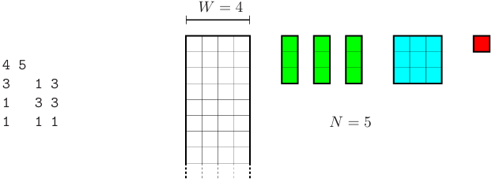
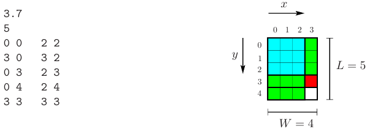

# Textile Factory

This project implements three algorithmic strategies: exhaustive search, greedy, and a metaheuristic to solve a textile production optimization problem based on real-world manufacturing constraints.

In this particular case, a textile factory produces rolls of fabric with a fixed width and variable length to fulfill client orders consisting of rectangular fabric pieces. 

The **objective** is to minimize the total length of the produced roll while cutting all required rectangles without overlap and respecting the input dimensions. 

## Input Format

An instance is provided as a text file with multiple lines of integer values representing the problem parameters. 

The first line contains to integers: **W**, the width of the fabric roll, and **N**, the number of fabric pieces to cut.

The following lines describe a type of fabric piece and follow this format: **nᵢ** **pᵢ** **qᵢ**.

Where nᵢ is the number of pieces of size pᵢ x qᵢ, pᵢ is the width and qᵢ the height of the rectangle.

It is guaranteed that: 1 ≤ W, 1 ≤ nᵢ, 1 ≤ pᵢ ≤ min(qᵢ, W) and N = ∑ nᵢ.

*The following figure shows the data of an instance. The roll used is 4 units wide, and we need to cut a total of 5 fabric rectangles: 3 of size 1x3, 1 of size 3x3, and 1 of size 1x1*


## Output Format

The output must follow a strict format to pass the provided checker and provide the following information: 
1. Execution time (in seconds) with 1 decimal.
2. The total length L of the fabric roll used.
3. The next N lines include rectangle placements, each with four integers: xtl ytl xbr ybr, coordinates of the top-left and bottom-right corners.

The fabric roll produced is represented as a 2D grid of cells with width W (values range from 0 to W - 1) and length L (values range from 0 to L-1). 

Rectangles can be placed vertically or horizontally, and can't overlap or exceed the roll boundaries. 

*Below is a graphical representation of a valid output solution for the given input. One of the 1x3 rectangles is placed vertically, while the other two are placed horizontally.*


## Algorithms Implemented

The project provides three different algorithmic approches to the fabric layout optimization problem:

- **Exhaustive Search (`exh.cc`)**: 
    A complete brute-force exploration of all possible rectangle placements. Whenever a better solution is found, it is written to the output file. Designed for small instances due to its high computational cost.

- **Greedy (`greedy.cc`)**: 
    The strategy used aims to produce a valid (not necessarily optimal) solution by making locally optimal choices. A key step is sorting the rectangles before placing them to improve spatial efficiency. The following criteria is used: 
    1. Descending order of the largest side. This prioritizes placing the largest rectangles first, which are harder to fit later.
    2. Tie-breaker: descending order of the smaller side. 
    By applying this sorting strategy, the algorithm improves the likelihood of achieving a solution maintaining a fast execution, even on large instances. 

- **Metaheuristic (`mh.cc`)**: 
    This algorithm uses **Simulated Annealing** to minimize the total length of fabric needed. Starting from a random initial placement of rectangles, it explores neighboring solutions by randomly swapping two rectangles and reassigning positions. Solutions that reduce the roll length are always accepted, while worse ones are accepted with a decreasing probability over time, allowing the search to escape local optima. The process continues for a fixed number of iterations, gradually cooling the system to converge toward an optimal or near-optimal solution.

## Testing

To validate the correctness of outputs a `checker` is provided:
```
./checker input.txt output.txt
```

## Authors

The project has been developed for Algorithms and Programming III subject by:
- Aleix Vernet
- Aina Vila


